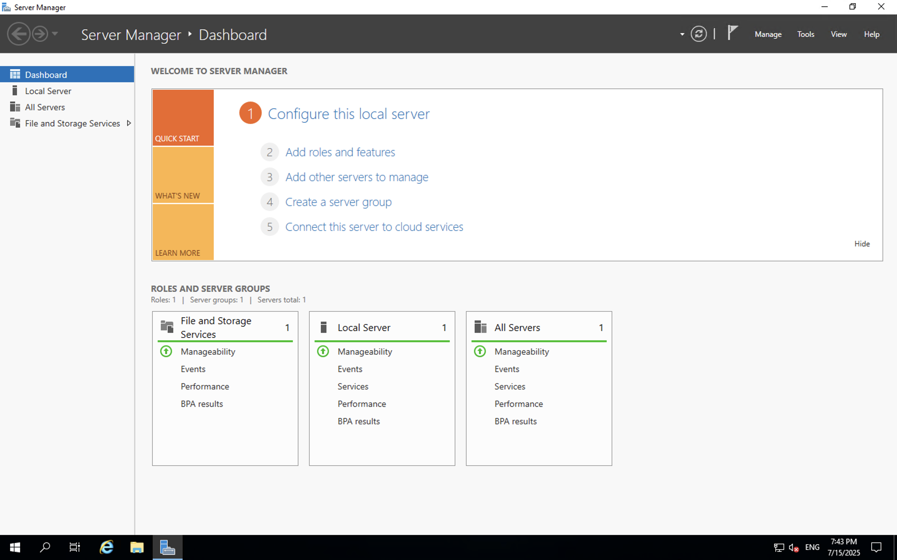
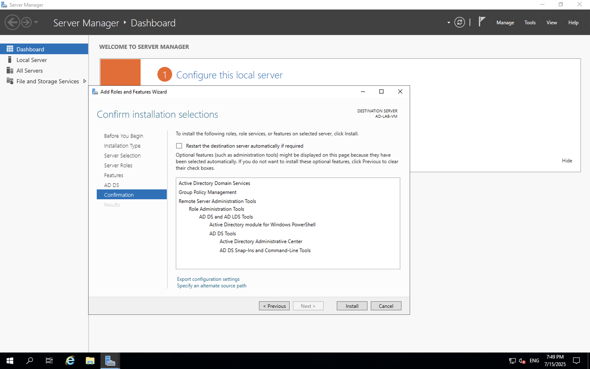
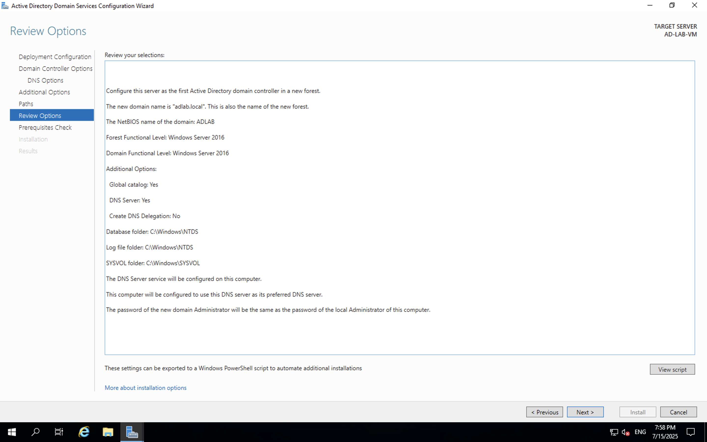
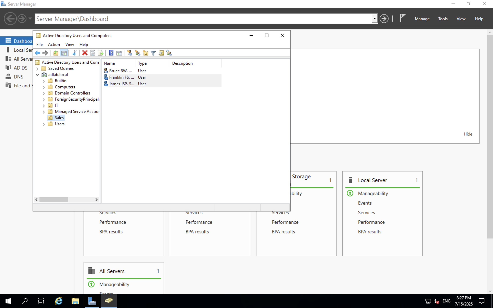
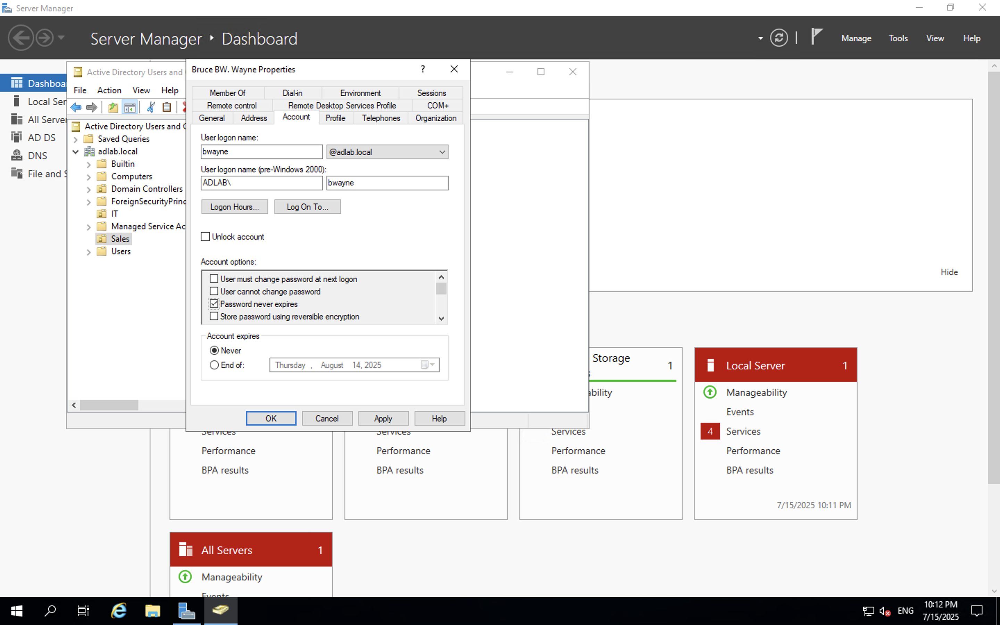
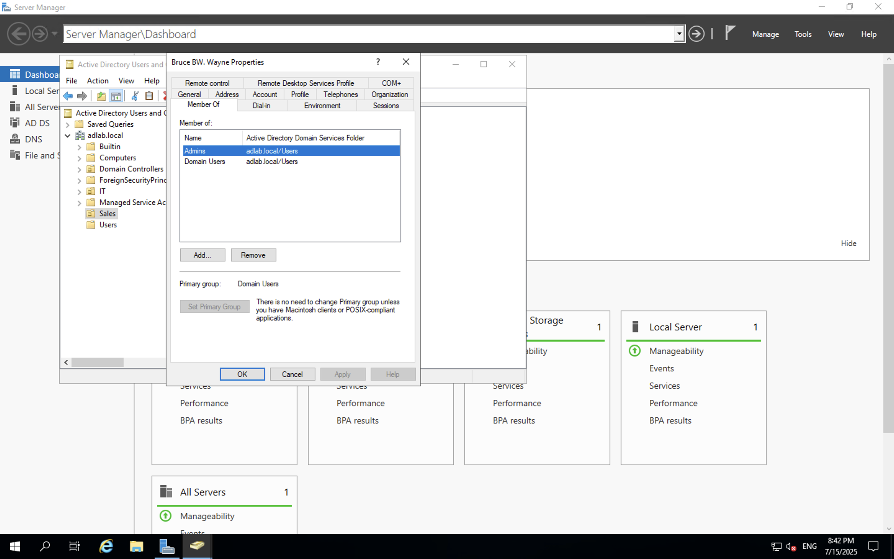
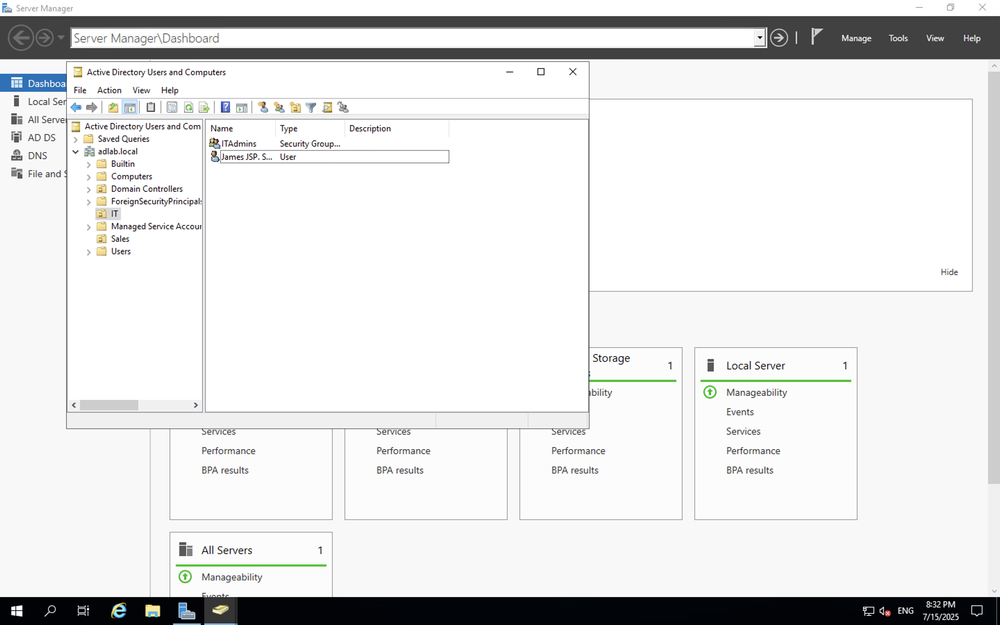
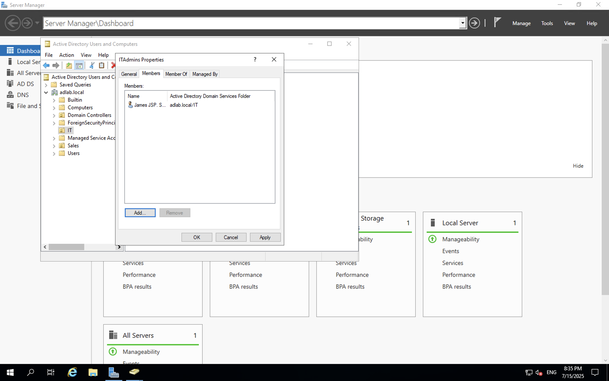

# Active Directory Lab (Core 2)

This project documents a hands-on Active Directory lab built on Microsoft Azure, designed to demonstrate OU structure, user/group management, and domain setup as part of my CompTIA A+ Core 2 journey.

---

## 🔧 Technologies Used

- Microsoft Azure (Free Tier)
- Windows Server 2019 Datacenter
- Active Directory Domain Services (AD DS)
- Remote Desktop Protocol (RDP) via Microsoft Remote Desktop (Mac)

---

## 🛠️ Lab Objectives

- Deploy a Windows Server VM on Azure
- Install and configure Active Directory Domain Services
- Promote the server to a domain controller
- Create Organisational Units: `Sales`, `IT`
- Create users and assign them to proper OUs
- Create and configure security groups: `Admins`, `ITAdmins`
- Assign users to groups
- Set password and account policies (e.g., Password never expires)

---

## 🧩 Lab Structure

Domain: adlab.local

OUs:
├── Sales
│ ├── bwayne
│ ├── jspatrick
└── IT
└── fsaint

Groups:
├── Admins (bwayne)
└── ITAdmins (jspatrick)

---

## 📸 Screenshots

| Step | Screenshot |
|------|------------|
| Azure VM Configuration |  |
| RDP Setup |  |
| AD DS Role Installation |  |
| Domain Promotion Success |  |
| OU + User Creation |  |
| User "Account" Tab |  |
| "Member Of" Tab (Group Membership) |  |
| Group Creation in OU |  |
| Group Members Screenshot |  |

> 📝 Rename your screenshots to match these, or adjust the file paths above to match your actual image filenames.

---

## 🔒 What I Learned

- How to deploy and configure a virtual machine on Azure
- How to install and manage Active Directory Domain Services
- How to create users, groups, and organise them using OUs
- How to apply group memberships and account policies
- Importance of clean documentation and structured project delivery

---

## 📌 Notes

This lab is part of my certification and career journey toward becoming a cybersecurity professional.  
It builds foundational knowledge for help desk, SOC, and sysadmin roles.

---

## 🧠 Next Steps

- Document labs for ticketing systems (e.g., Spiceworks or OTRS)
- Start Security+ and AZ-900 labs with GitHub documentation
- Build up a full SOC analyst portfolio over the next 90 days